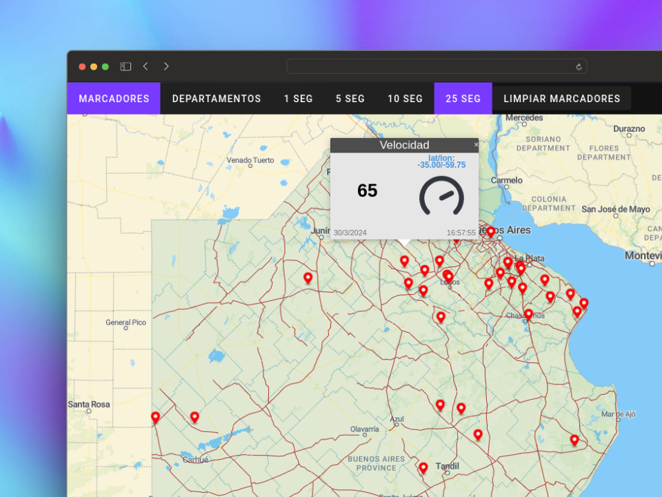

# Real-Time Events Visualization

This repository contains a real-time events visualization application.

The frontend is built using Nuxt.js 3, Pinia for state management, WebSocket with Socket.io for real-time communication, and TypeScript for implementing maps and visualizations of these events.

The backend is built using Java with CrateDB. There's a client and a server, the communication is done by gRPC calls.

## Features

- _Real-Time Visualization:_ The application provides real-time visualization of events on maps.
- _Interactive Interface:_ Users can interact with the maps and explore events in real time.
- _State Management with Pinia:_ Pinia is used for efficient state management within the application.
- _WebSocket with Socket.io:_ WebSocket with Socket.io ensures real-time communication between the client and server.
- _Client/Server communication with gRPC:_ gRPC is utilized for efficient and high-performance streaming communication between the client and server.
- _High availability, cost efficient storage with CrateDB:_ [CrateDB](https://cratedb.com/) is a distributed open-source SQL database.
- _TypeScript:_ TypeScript is used for implementing maps and other visualizations, providing type safety and better code maintainability.

## Prerequisites

Before running the application, ensure you have the following installed:

- openjdk (version >= 21.x.x)
- maven
- node.js (version >= 18.x)
- npm
- make
- docker

## Usage

Start the backend server:

```bash
cd app
docker compose up -d
make server
```

Initialize bots to send messages:

```bash
make client bots=$NUMBER
```

where `$NUMBER` is the number of bots.

Launch the frontend server:

```bash
cd frontend
npm install
npm run dev
```


